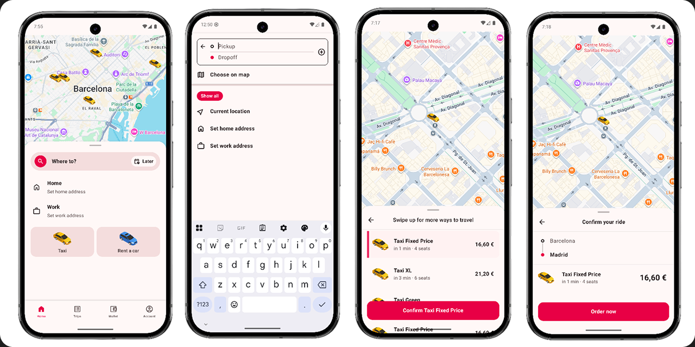
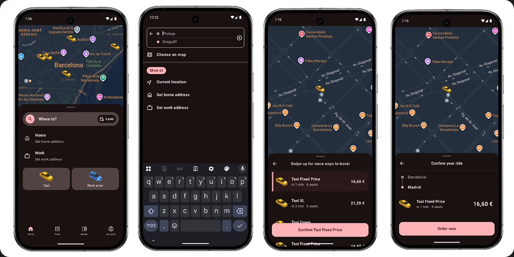

# Freenow Demo
A fully functional Android application built as a technical showcase, directly inspired by the 
**Freenow** app.

While it's not an exact clone, this demo demonstrates how to structure a modern, scalable 
Android app. It’s written entirely in Kotlin with Jetpack Compose, utilizing a MVI (Model-View-Intent) architecture, 
Unidirectional Data Flow (UDF), and offline-first design.

## UI & Interactive Flows
The UI is built using Jetpack Compose and Material 3, featuring adaptive bottom sheets and 
Google Maps camera synchronization, among others.

> [!NOTE]  
> The demo supports Dark mode and Dynamic Theming

### Screenshots




## Architecture
This app follows official Android architecture guidance, separating concerns into discrete layers 
to ensure scalability and testability.

* **Presentation Layer:** Strictly stateless Jetpack Compose screens that react to `ViewState` 
  emissions.
* **ViewModel Layer:** Manages state via `StateFlow` and handles one-off navigation/dialog 
  events using Kotlin `Channel`s to prevent dropped events during configuration changes.
* **Data & Domain Layer:** Repositories expose reactive `Flow<Result<T>>` streams, ensuring the 
  UI is entirely decoupled from the network data mapping logic.

## Testing Infrastructure
To guarantee the stability of the MVI pipeline, this project implements tests adhering to modern 
Android standards:

* **JVM Unit Tests (`test`):** Validates ViewModel logic, state conflation, and side-effect 
  emissions using `kotlinx-coroutines-test` and CashApp's `Turbine`.
* **Instrumented UI Tests (`androidTest`):** Mounts Compose nodes in isolation using 
  `createAndroidComposeRule`. Tests verify dynamic UI states, physical click callbacks, and 
  proper localized string resolutions without relying on manual QA.

## Tech Stack
| Layer                    | Technology                                    |
|--------------------------|-----------------------------------------------|
| **UI**                   | Jetpack Compose, Material 3, Edge-to-Edge     |
| **State Management**     | MVI, ViewModel, StateFlow, Coroutines         |
| **Dependency Injection** | Hilt                                          |
| **Networking**           | Retrofit, OkHttp, `kotlinx-serialization`     |
| **Maps & Location**      | Google Maps Compose (`maps-compose`)          |
| **Animations**           | Lottie Compose                                |
| **Testing**              | JUnit 4, Turbine, Compose UI Test             |
| **CI/CD & Formatting**   | GitHub Actions, Fastlane, `ktlint`, Git Hooks |

## Getting Started
### Prerequisites
* Android Studio (Latest Stable)
* Min SDK: 26 (Android 8.0)

### Setup Instructions
1. Clone the repository.
2. Add your Google Maps API key to the `local.properties` file in the root directory:

   ```properties
   MAPS_API_KEY=your_google_maps_api_key_here
   ```
3. Sync the Gradle project and hit Run on the app configuration.

## License
This project is for demonstration and portfolio purposes only.
