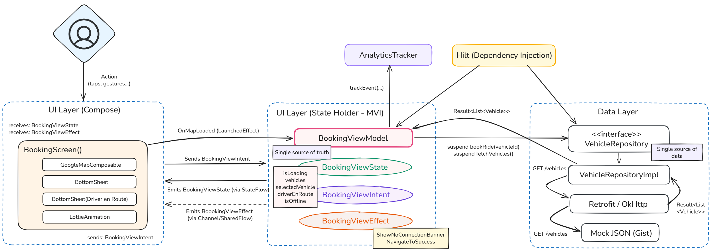
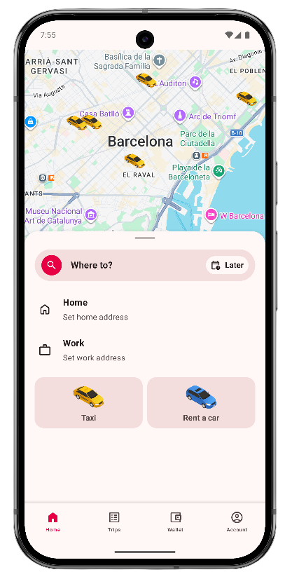
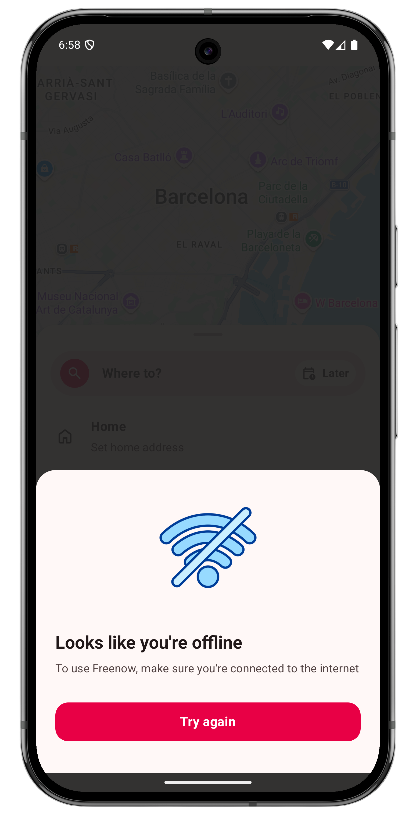
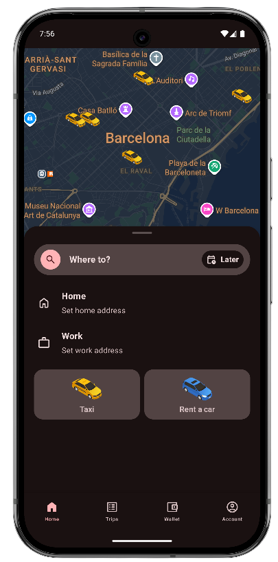
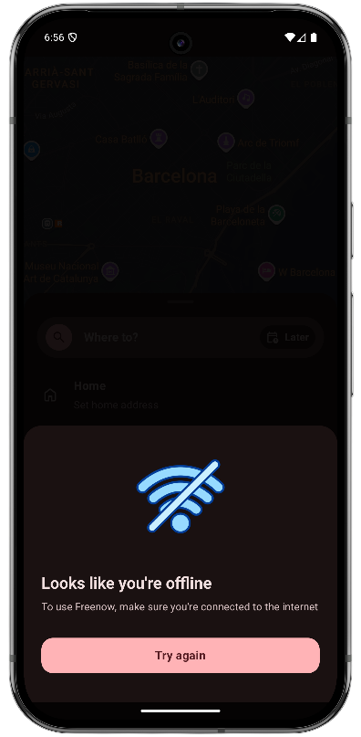
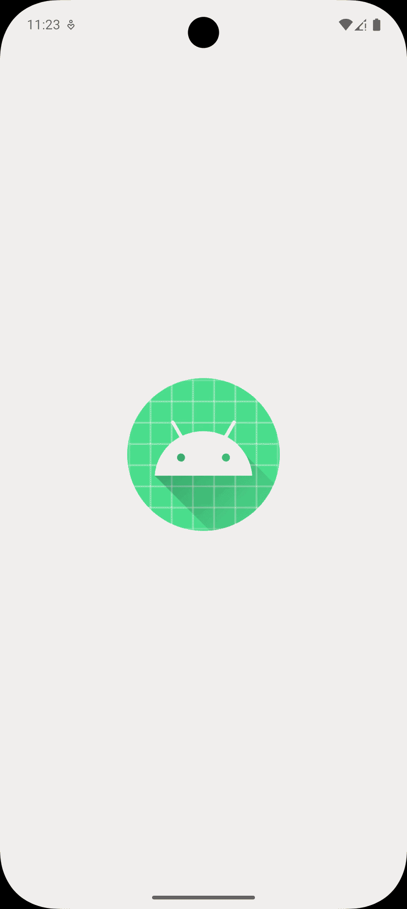
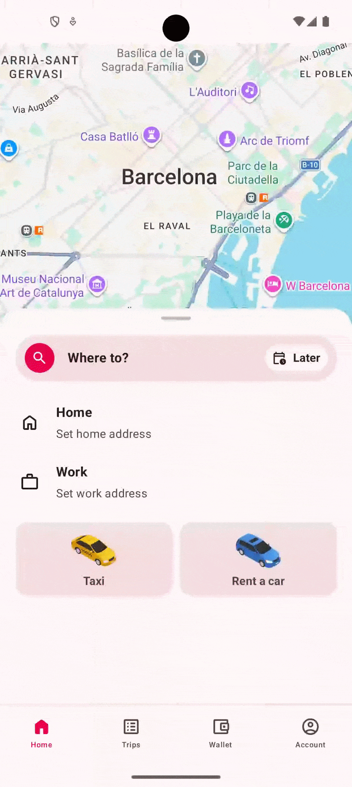
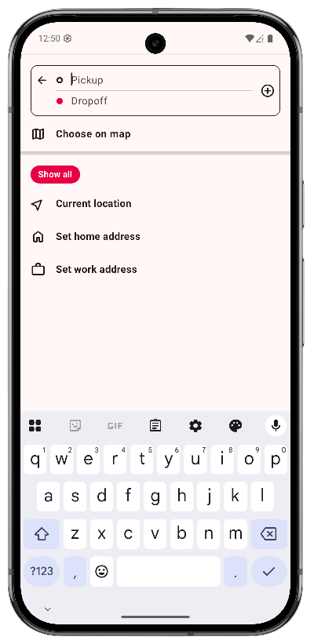
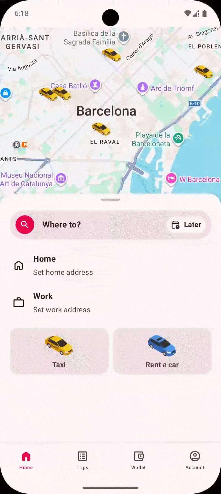
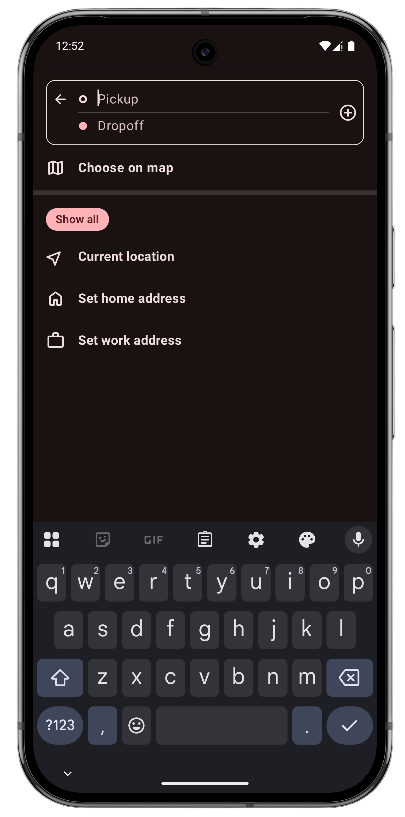

# Freenow Demo

A demo Android app inspired by Freenow booking flow.
This project was built to demonstrate modern Android development practices, 
emphasizing a strict **MVI architecture** and reactive UI with **Jetpack Compose**.

> **🚧 Project Status: Work in progress** 
> <br>*This project is currently under development. Below is
> the roadmap of completed and upcoming features.*
>
> - [x] **Infrastructure:** Hilt, ktlint, GitHub Actions CI, etc.
> - [x] **UI shell:** Material 3 theming, Navigation Bar, Bottom Sheet Scaffold, Maps compose, etc.
> - [x] **Core architecture (MVI):** Unidirectional Data flow using StateFlow and Channels.
> - [x] **Networking & Maps:** Retrofit integration with GitHub Gist mock API, rendering different 
>       vehicles on `maps-compose`.
> - [x] **Graceful degradation:** MVI Offline toggle with a custom connection Dialog and 
>       Lottie loading states.
> - [x] **Destination flow:** Built the Destination screen with form validation, custom text
    >       inputs, and a `SavedStateHandle` navigation handshake back to the map.
> - [ ] **Booking confirmation:** Synchronizing the Bottom Sheet UI with Google Maps camera
    >       animations and handling the final booking state. *(Currently working on this)*
> - [ ] **Polish & tests:** Coroutine Unit Tests for the ViewModel, AnalyticsTracker injection, etc.

## Architecture

The app follows a Unidirectional Data Flow (UDF) alongside a Model-View-Intent (MVI) 
pattern. The project structure is inspired by Google's `Now in Android` (NiA) architecture 
guidelines, separating `core` utilities from `feature` layers.


> *Note: This diagram reflects the initial version of the demo. It will be updated upon project 
> completion to reflect the final multi-screen route refactor and cross-screen state handling.*

## Features

- Native support for English and Spanish (values-es).
- Graceful offline degradation and error handling.
- Accessibility support.
- Analytics (ready for Mixpanel/Braze).
- Modern Compose animations (Lottie)

## Screenshots

### Booking & State Handling
|           | Booking Screen                                              | Offline Dialog                                              |
|-----------|-------------------------------------------------------------|-------------------------------------------------------------|
| **Light** |  |  |
| **Dark**  |    |    |

### Interactive Flows
|           | Loading map                                                  | Drag Handle                                               |
|-----------|--------------------------------------------------------------|-----------------------------------------------------------|
| **Light** |  |  |

### Destination Flow
|           | Destination Screen                                                  | Validated Form                                                    |
|-----------|---------------------------------------------------------------------|-------------------------------------------------------------------|
| **Light** |  |  |
| **Dark**  |    |                                                                   |


## Tech stack

| Layer                | Technology                                |
|----------------------|-------------------------------------------|
| UI                   | Jetpack Compose, Material 3               |
| State Management     | ViewModel, StateFlow, Coroutines          |
| Dependency Injection | Hilt                                      |
| Networking           | Retrofit, OkHttp, `kotlinx-serialization` |
| Animations           | Lottie Compose                            |
| Testing              | JUnit, Coroutine Test *(Upcoming)*        |
| CI/CD                | GitHub Actions, Fastlane                  |
| Maps                 | Google Maps Compose (`maps-compose`)      |
| Code Style           | ktlint                                    |

## Getting started

### Prerequisites

- Min SDK: 26

### Setup

1. Clone the repository
2. Open the project in Android Studio
3. Add your Google Maps API key to `local.properties` file in the root directory:
```properties
MAPS_API_KEY=your_key_here
```
4. Run the app

## Project structure

```
app/src/main/java/com/example/freenowdemo/
├── core/
│   ├── analytics/
│   ├── data/
│   ├── designsystem/
│   ├── model/
│   └── network/
├── feature/
│   └── booking/
└── ui/
    ├── components/
    └── navigation/
```

## CI/CD

GitHub Actions runs on every pull request:
- ktlint formatting check
- Unit tests
Fastlane is configured with lanes for automated testing and APK assembly.

## License

For demo purposes only.